# Tutorial

For this tutorial we are using a slimmed down replication of 
[Neurobiological impact of nicotinic acetylcholine receptor agonists: An ALE meta-analysis of pharmacological neuroimaging studies](https://www.ncbi.nlm.nih.gov/pmc/articles/PMC4494985/).

After this tutorial, you will gain a basic understanding of how to use NeuroSynth-Compose to conduct a meta-analysis. Specifcially, you will learn about:

1. Creating a project
2. Searching for studies on pubmed
3. Adding studies to a project
4. Curating studies using PRISMA guidelines
5. Extracting data from analyses within studies
6. Specifying a meta-analysis
7. Executing a meta-analysis
8. Displaying meta-analytic images
9. Interpreting meta-analytic results
10. Considerations for follow-up analyses

We will be following Dr. Annie Litical as she conducts a meta-analysis on the effects of nicotine administration on brain activity, but is in an enourmous rush to get it done before the end of the day.

## Story

```
Dear Dr. Litical,

We hope you have settled in to your new Post Doctoral position at the University of NeuroSynth.
It has now been a month since you started and we are excited to see what you have been working on.
We would like you to send us a report of your progress so far by end of day today.

Sincerely,
Your Boss: Dr. I. M. Portant

```

"Oh no!, I haven't done anything yet!" Dr. Litical exclaimed.
"I knew binge watching [Bee and Puppy Cat](https://www.youtube.com/watch?v=dop4MTlf_zc) repeatedly was a bad idea."
(And yet, she did not regret it.)
She had to think of something fast.
Dr. Litical scrambled to her computer and opened up the browser.
She knew some of her colleagues had been using NeuroSynth-Compose to conduct meta-analyses, and thought she might be able to use it to get some results, and then she could add to her meta-analysis once she had more time.
She navigated to [compose.neurosynth.org](https://compose.neurosynth.org) and was immediately struck by the beautiful design.
"Wow, this is so much better than the old NeuroSynth!" she thought.
"Whoever designed this must be have put a lot of thought and care into the interface."
She clicked on the "Sign In" button and was greeted with a login screen.


She signed in with her Google account and was taken to the dashboard.
The most prominant element of the dashboard was "Projects".

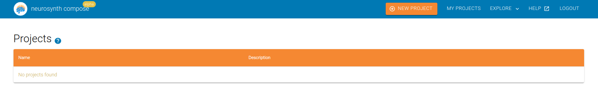

"Perfect!" she thought, I need to create a project.
She clicked on the "New Project" button and a popup appeared asking for a name
and description of the project.
"Bugger!", Dr. Litical cursed under her breath, she had not decided on a topic for her meta-analysis.
Quickly, she rummaged through her drawer of meta-analyses she had read recently,
"Imitation is the sincerest form of flattery", she mumbled to no one in particular as she leaved through
the publications.
One stuck out to her: `Neurobiological impact of nicotinic acetylcholine receptor agonists`.
She had taken a neurobiology class in college and the class had a whole section on nicotinic acetylcholine
receptors.
Dr. Litical was back in business.

:::{important}
This tutorial is not a recommendation on how one should choose a topic for meta-analysis. One should give proper thought on what their meta-analysis is about, and have talked to their mentors and collaborators beforehand.
:::

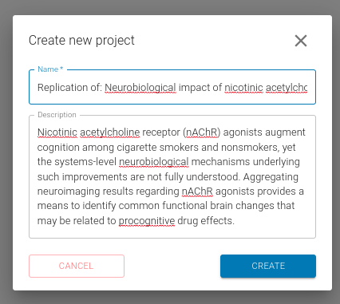

She the following information for name:
```
Replication of: Neurobiological impact of nicotinic acetylcholine receptor agonists
```

and description:
```
Nicotinic acetylcholine receptor (nAChR) agonists augment cognition among cigarette smokers and nonsmokers, yet the systems-level neurobiological mechanisms underlying such improvements are not fully understood. Aggregating neuroimaging results regarding nAChR agonists provides a means to identify common functional brain changes that may be related to procognitive drug effects.
```

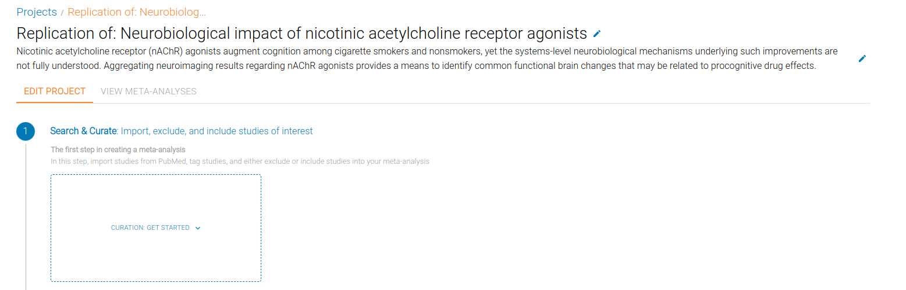

After clicking "Create", she was taken to her new project.
Dr. Litical's next step is to curate the studies she wants to include in her meta-analysis.


## Searching for studies

Dr. Litical clicked within the box "Curation: Get Started", and was presented with
three options: "PRISMA Workflow", "Simple Workflow", and "Custom Workflow".


Since Dr. Litical is replicating a manually curated meta-analysis, she selcted the "PRISMA Workflow".

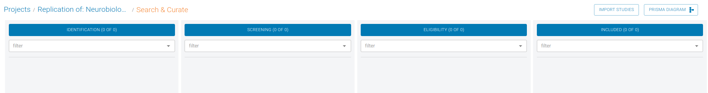

She was presented with an empty curation board, with 4 sections: "Identification",
"Screening", "Eligibility", and "Included".


Hopping over to Pubmed, Dr. Litical put the following in the advanced search box:
```
("fMRI" OR "PET" OR "neuroimaging" OR "Functional magnetic resonance imaging" OR "functional MRI") AND ("nicotine" OR "cigarette" OR "smok*" OR "DMXB-A") AND ("2011/01/01"[Date - Publication] : "2011/12/31"[Date - Publication])
```
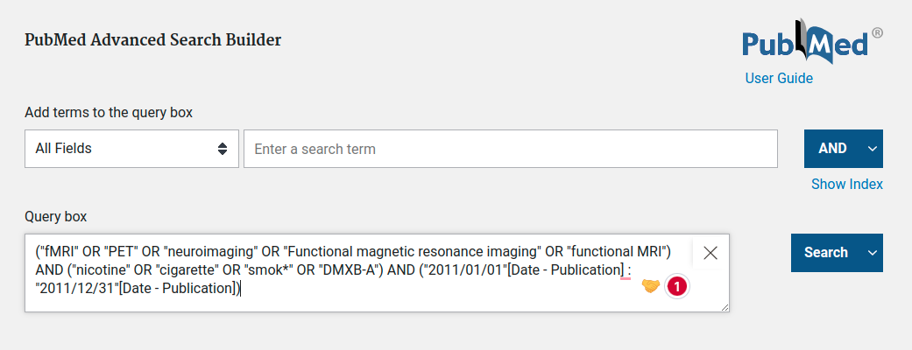


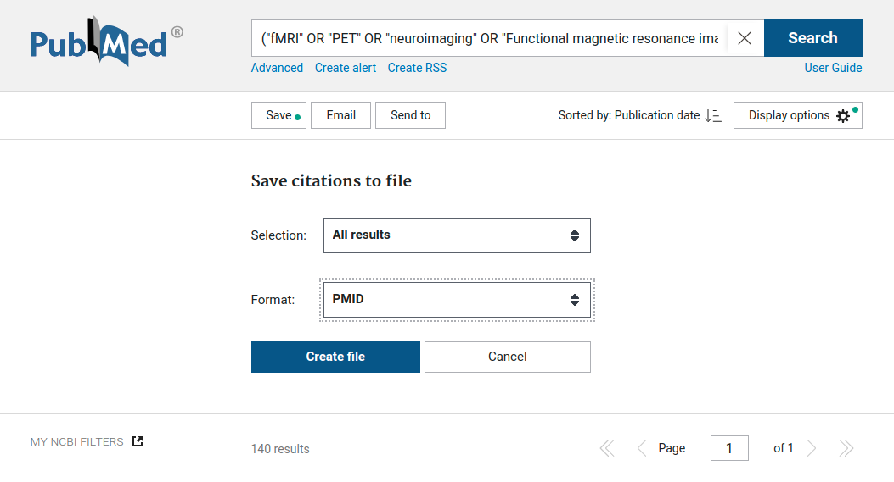


We are only searching for studies in 2011 to keep the results shorter.
140 results! Oh no, that will still take too much time.
Luckily Dr. Litical remembered that she had previously narrowed down a list of pubmed ids.
She found the file and continued to the next step.

**[TUTORIAL PMID FILE](./data/tutorial_pmids.txt)**


Dr. Litical named the search
"manually filtered nicotinic acetylcholine receptor agonists pubmed search" and clicked "Next".
There were no duplicates, so she clicked "Complete Import".

## Identification

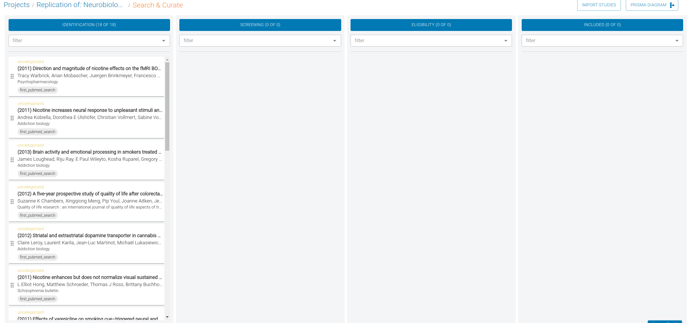


Dr. Litical was now presented with the list of studies that she had imported.
While the import stage has handled any obvious
duplicates, the Identification stage is where she will be able to identify any duplicates that were not caught automatically.
Luckily, there were no duplicates, so each study was promoted to the next stage for screening.

## Screening

In this stage, Dr. Litical is attempting to determine if the study has any relevancy to her meta-analysis.
For example, the study could be about cannibas
or it could be about corectal cancer, which are topics Dr. Litical is not interested in.
Now Dr. Litical takes a closer look at the title and abstract of each study and identifies whether each study has relevancy to her meta-analysis.

## Eligibility

With duplicates and relevancy resolved, Dr. Litical is now ready to determine if the study meets the eligibility criteria.
In this stage Dr. Litical needs to read the methods
section of each study and determine if it meets the eligibility criteria.
Each paper may take several minutes to evaluate, so Dr. Litical will need to be patient and thorough.


### Eligibility criteria

We included studies in this meta-analysis that: 1) employed fMRI or PET; 2) reported brain activity changes in stereotaxic coordinates (either Talairach or MNI space); 3) reported a set of coordinates (i.e., foci) from a within-subjects or between-subjects contrast assessing the effects of nAChR agonist administration (i.e., pharmacological administration or cigarette smoking) relative to a baseline condition (i.e., placebo administration or smoking-abstinence condition); and 4) examined brain activity using a cognitive or affective task paradigm or at rest (i.e., in the absence of explicit task demands). Studies examining functional connectivity, brain morphology, or neurochemistry were not included. Given the relatively modest but expanding corpus of literature regarding the impact of nAChR agonists on human brain function, no study exclusions were made on the basis of participant age, neuropsychiatric condition, or statistical threshold considerations.


## Ingestion

Horray, Dr. Litical has reached a critical milestone in her meta-analysis journey.
Once the studies are ingested, Dr. Litical will be able to extract the data from each study.

The ingestion process includes looking up the study on NeuroSynth-Compose's database and asking
Dr. Litical if she would want to use a pre-existing study or create a new one.
If Dr. Litical chooses to use a pre-existing study, then she will inherit all the data that was already extracted from that study, which will often include coordinates and will save her a lot of time during the extraction phase.

## Extraction

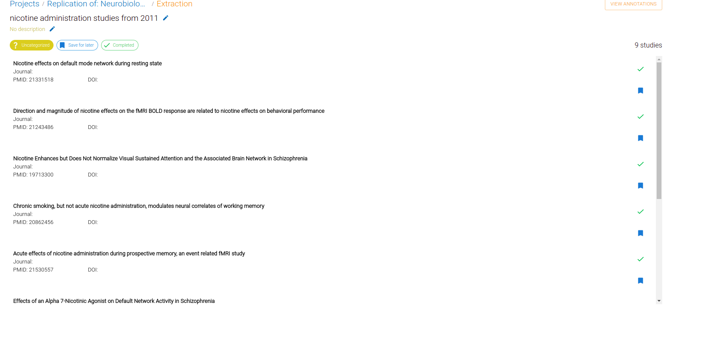

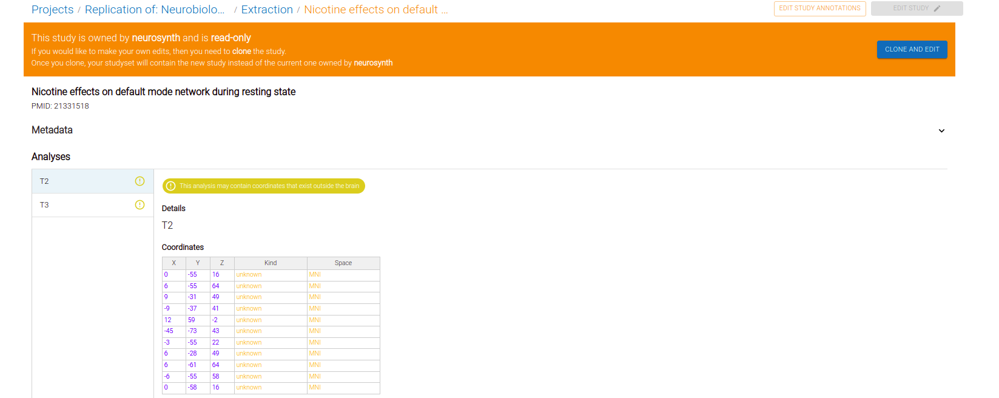

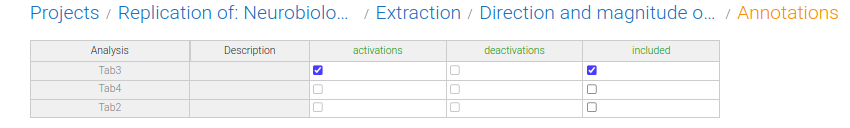


Dr. Litical is on a roll.
She has now reached the extraction phase.
In this phase, Dr. Litical will extract the data from each study, which will often include
coordinates and annotations.

Within the context of a meta-analysis, Annotations can be explained as a way to categorize analyses within each study.
For example, they can be categorized by task (e.g., Stroop, N-back, etc.), by modality (e.g., fMRI, PET, etc.), or by any other category that you want to use to filter the analyses.
For this replication, Dr. Litical is interested in the effects of nAChR agonists on the brain, which can either be excitatory or inhibitory, so she adds both an "activation" and "deactivation" column.
By default you will have an "include" column to help get you started.

In conjunction with annotating the analyses, Dr. Litical will also need to extract and/or edit the coordinates for each analysis.
While NeuroSynth-Compose has many coordinates automatically extracted, Dr. Litical will need to extract the data from some of the analyses NeuroSynth-Compose has not seen before.
Dr. Litical is estatic that almost half of the the studies already have coordinates extracted from the analyses.


For the rest, NeuroSynth-Compose provides an interface to add/edit coordinates.
Dr. Litical can either directly add the coordinates on the website or she can upload a csv file with extracted coordinates.

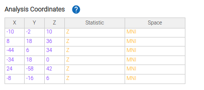
She skillfully add the coordinates for the remaining studies and is now ready to move on to the next stage.


## Meta-analysis specification


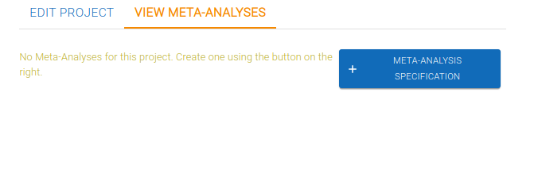


Dr. Litical is now ready to select the analyses and specify the algorithm.
She clicks on the "Meta-Analysis Specification" button and is presented with a wizard that will guide her through the process.
She names this meta-analysis: "nicotinic agonist activations".

For this particular meta-analysis she chooses "activation" and goes through a wizard
to specify the algorithmic parameters for her meta-analysis.

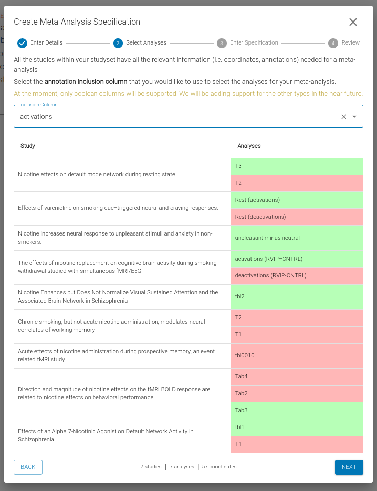
Dr. Litical is now ready to specify the algorithmic parameters for her meta-analysis.
She chooses ALE (Activation Likelihood Estimation) as the algorithm and selects
8mm as the kernel size.
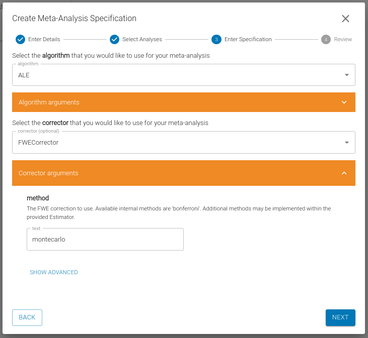

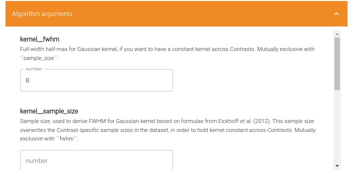


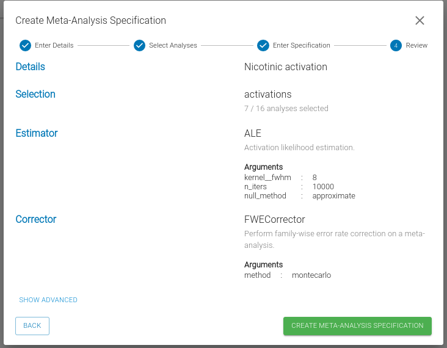
She selects the Family Wise Error rate corrector (FWE) and uses montecarlo simulation to estimate the null distribution.
She chooses 10000 iterations and 0.05 as the p-value threshold.

## Running the meta-analysis

With the analyses selected and the algorithm chosen and specified, Dr. Litical is now ready to run the meta-analysis.
She follows the google colab link and inserts the identifier that specifies the meta-analysis.
she wants to run.

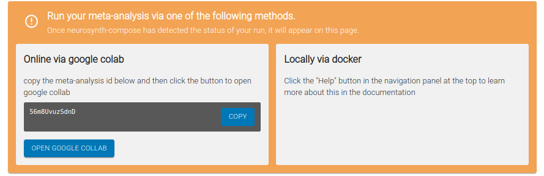

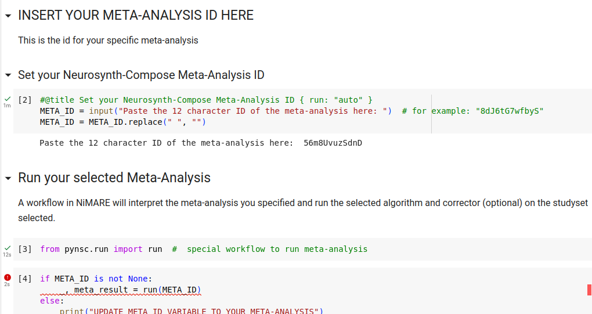

She executes the analysis and waits for the results.
She is running a relatively small meta-analysis so she does not have to wait long
for the process to finish executing.

## interpreting the results

Dr. Litical can hardly contain her excitement, but yet she must remain calm and collected,
otherwise she will not be able to interpret the results correctly.
It is important to remember what inferences you can and cannot make from a meta-analysis.

Looking at the top of the generated report Dr. Litical checks to see how many studies
were included in the meta-analysis and checks to see if any studies were excluded.
None were excluded so she can move on to check the mask, to ensure it is a whole brain mask.
Seeing the mask covers the whole brain, she moves on to check the peak coordinates reported from
all the analyses included in the meta-analysis.
In this step, she can see which coordinates are outside the mask and if there is an unusual distribution
of coordinates (e.g., they are all on the left side of the brain, or many appear to be white matter tracts).

She confirms that the meta-analytic parameters she chose in the specification match what is inside the report.
Then she can interactively view the results to see where the significant clusters are located.
Remembering her training, Dr. Litical recalls the Activation Liklihood Estimation creates values that can be interpreted as the probability that a voxel is activated given the studies included in the meta-analysis.
The z-values she is looking at represent the significance of that activation relative to a baseline of the voxel's expected activation if all the foci were randomly distributed across the brain.
And the z-scores have been corrected with FDR (False Discovery Rate) correction, to help control for false positives.

She finds some interesting clusters in the DMN region and ECN networks. These networks
are considered task negative and task positive networks respectively.
Since we did not differentiate between whether the coordinates included in the meta-analysis represented an increase or decrease in activation, Dr. Litical cannot make any inferences about whether the nAChR agonists increased or decreased activation in these regions, merely that coordinates were reported in these regions.

